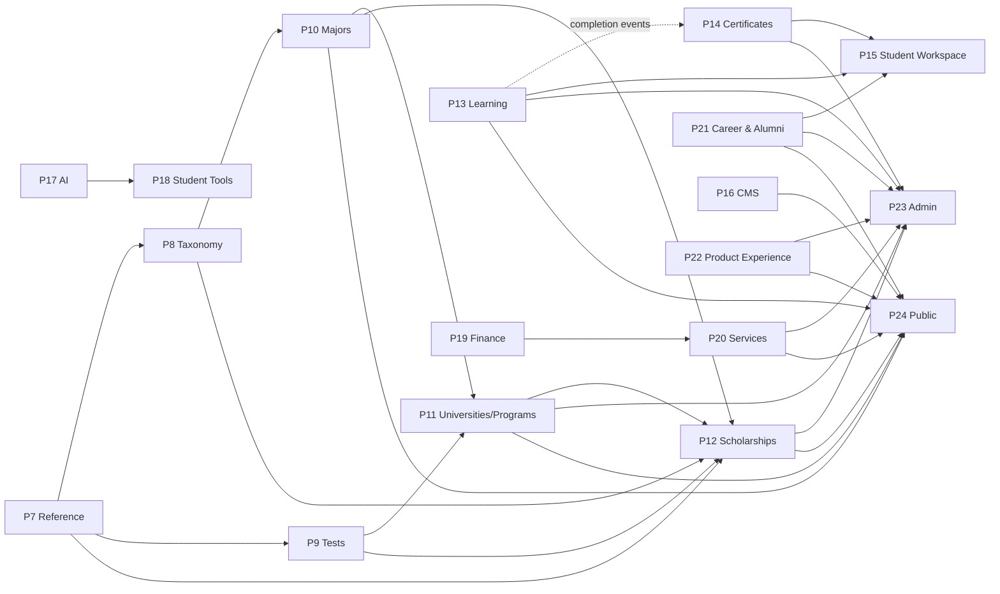

# Enterprise-Bounded-Context-Map-v1.0

## 1. Document Information

- **Title:** Enterprise Bounded Context Map
- **Version:** 1.0.2
- **Status:** Finalized — aligned with Roadmap v6.0
- **Date:** 2026-09-03
- **Owner:** Chief Enterprise Software Architect
- **Approval Authority:** Architecture Review Board (ARB)
- **Artifact Type:** Domain-Driven Design (DDD) Artifact
- **Authority:** `docs/governance/roadmap/MANARATAK-2.0-Roadmap-v6.0.md`

> **P13 Final Source Alignment — 2026-09-03:** Re-audited against Roadmap v6.0 and the final source implementation. Ownership and dependency direction remain authoritative. Student Workspace composes P10/P11/P12 saved-item owner reads plus P13 learning and P14 certificate reads through application contracts; P24 live composition consumes P15 session/API state. Runtime/DB/E2E proof remains explicitly pending and is not certified by this document.

## 2. Purpose

This context map defines the Roadmap v6.0 P7–P24 bounded-context boundaries that matter to source closure. It prevents domain ownership leakage and specifies whether cross-context integration is via canonical reference, owner API/read model, event, control-plane composition, or public composition.

## 3. Binding Boundary Rules

- No direct database/Prisma access across owning contexts.
- No shared mutable domain model between phases.
- Owner truth is consumed through explicit API/read-model/event contracts.
- Canonical IDs from upstream authorities are used when available; translated labels and names are presentation data, not final identity.
- Reverse lookup/navigation is a projection and never creates circular ownership.
- P23 and P24 are composition contexts, not alternate persistence owners.
- Broad university/scholarship application processing is not assigned to P12 or P15 by this map. Any future owner requires an explicit Roadmap/ADR decision.

## 4. Roadmap v6.0 Bounded Contexts — P7 to P24

| Phase | Bounded Context | Owns | Explicitly Does Not Own |
| --- | --- | --- | --- |
| **P7** | Global Reference Data | Canonical country/region/city/language/currency and shared reference identity/resolution | Majors, universities, scholarships or downstream lifecycle rules |
| **P8** | Academic Taxonomy | Academic taxonomy nodes, classification hierarchy, DegreeLevel and taxonomy mappings | Canonical Majors |
| **P9** | International Tests | Canonical test identities, score/validity/registration reference semantics | University admissions decisions or scholarship eligibility truth |
| **P10** | Majors & Disciplines | Canonical Major identity, aliases/equivalency and major lifecycle/read models | Taxonomy/degree ownership; university programs; scholarship/course relationships |
| **P11** | Universities & Institutions | Universities, campuses, organization units, AcademicPrograms and admissions requirements | Canonical Major/Taxonomy/Test identities |
| **P12** | Scholarships | Scholarship definitions, eligibility, benefits/documents and canonical relationships to P7–P11 | General Student Workspace; unspecified broad application-processing platform |
| **P13** | Learning | Courses, learning paths, curriculum/progression/completion facts | Certificate issuance/verification/revocation |
| **P14** | Enterprise Certificates | Certificate issuance, verification, revocation, templates/signature policy and credential lifecycle | Learning completion truth |
| **P15** | Student Workspace | Private student profile/workspace, collections, recently viewed/history, privacy/preferences, dashboard and domain references | Universities, scholarships, courses, certificates, broad university/scholarship application processing |
| **P16** | Enterprise CMS | Editorial content/version/localization/SEO lifecycle | Core domain business records |
| **P17** | Enterprise AI | AI provider/model routing, prompts, inference, embeddings, safety/cost execution | Business-domain source of truth; Student Tools registry |
| **P18** | Enterprise Student Tools | Tool registry, deterministic/AI-assisted tool orchestration, tool experience and outputs | AI vendor execution; source domain persistence |
| **P19** | Finance & Payments | Payments, ledger, invoices, refunds, settlement and financial execution/status | Course/service domain truth |
| **P20** | Enterprise Services | Service catalog, requests, fulfillment, provider dispatch and SLA semantics | Payment/ledger execution |
| **P21** | Career & Alumni | Jobs/internships, career applications, alumni profiles and bounded recruitment metadata | Standalone Organizations & Employers platform outside Roadmap scope |
| **P22** | Product Experience | Product identity, personas, experience principles and UX objective contracts | Domain business persistence |
| **P23** | Enterprise Administration Portal | Admin UI/control-plane composition, review/approval surfaces and command dispatch | Owner business logic, cross-domain Prisma, duplicated domain persistence |
| **P24** | Enterprise Public Platform | Public layout/composition, visitor routing, SEO, public page assembly | Underlying P7–P21 business records/lifecycle |

## 5. Principal Context Relationships

| Upstream / Owner | Consumer | Integration Pattern | Boundary |
| --- | --- | --- | --- |
| P7 Reference | P8–P24 where needed | Published reference contract / canonical IDs | Consumer never redefines reference identity. |
| P8 Taxonomy | P10/P11/P12 | Published language / IDs | P10 owns Majors; P8 only classifies them. |
| P9 Tests | P11/P12 | Published test read models / IDs | Requirements reference P9 IDs, not names. |
| P10 Majors | P11/P12/P13/P18/P24 | Owner read models / IDs | Relationship ownership remains downstream. |
| P11 Universities & Programs | P12/P15/P24 | Owner read models / IDs | P15/P24 consume; they do not own programs. |
| P12 Scholarships | P15/P24 | Published read models / references | Workspace/public composition only. |
| P13 Learning | P14 Certificates | **Event-driven only for completion** | `CourseCompleted` / `LearningPathCompleted`; no synchronous certificate-generation API. |
| P13 Learning | P15/P24 | Learning read models | Progress/catalog remain P13 truth. |
| P14 Certificates | P15/P24 | Certificate read models/events | Credential lifecycle remains P14 truth. |
| P16 CMS | P24 | Published editorial read models | Public rendering remains P24. |
| P17 AI | P18 Tools | Open Host Service / AI execution contract | Tools orchestrate; AI provider execution remains P17. |
| P19 Finance | Monetized domains | Finance contracts / status projections | Payment truth remains P19. |
| P20 Services | P15/P24 | Service read models | Private/public presentation does not re-own service truth. |
| P21 Career & Alumni | P15/P24 | Career/alumni read models | Career application ownership is P21-specific, not a generic P15 application engine. |
| P7–P21 owners | P23 Admin | Owner command/query APIs | P23 is control plane only. |
| Published P7–P21 owners | P24 Public | Published read models | P24 is composition only. |

## 6. P13 → P14 Credential Boundary

The Learning context owns the fact that a student completed a course or learning path. It publishes completion events. The Certificates context consumes those facts and independently applies certificate eligibility, template/signature policy, issuance, verification and revocation rules.

**Forbidden:** a synchronous P13 `Certificate Generation API` or certificate entity lifecycle inside P13.

**Required direction:**

```text
P13 Learning completion
  -> CourseCompleted / LearningPathCompleted event
  -> P14 Certificates eligibility/policy
  -> CertificateIssued / CertificateRevoked events/read models
  -> P15/P24 consumers
```

## 7. P15 Student Workspace Boundary

P15 owns personal workspace state and may hold references/projections to domain-owned entities. It may display saved universities, scholarships, learning progress, certificates, services or career items. Such references do not transfer lifecycle ownership.

This map deliberately does **not** define a general University Application or Scholarship Application aggregate under P15. Historical statements that did so are superseded by this Roadmap v6.0-aligned boundary until an explicit owner is adopted.

## 8. P23 / P24 Composition Boundaries

- **P23 Admin:** control plane. UI/selectors/editors invoke owner Application/API contracts. No direct cross-domain persistence and no duplicate business rules.
- **P24 Public:** composition plane. It renders only published owner read models and owns routing/SEO/page assembly. It must not create shadow copies of canonical domain truth.

## 9. Visual Context Map



## 10. Validation

P1 authority alignment is closed only if all of these are simultaneously true:

- P7–P24 current contexts are represented;
- P8 taxonomy/DegreeLevel and P10 Major ownership are separate;
- P12/P15 no longer claim unspecified broad scholarship/university application ownership;
- P13→P14 uses completion events only and P14 remains credential authority;
- P23/P24 are composition contexts without domain persistence ownership;
- the Dependency Graph, Ownership Matrix, Event Catalog and API Registry use the same boundaries.

## 11. Approval and Revision History

- **Architecture Review Board:** Approved baseline; P1 authority alignment applied 2026-09-03.
- **Chief Enterprise Software Architect:** Approved baseline; Roadmap v6.0 is controlling authority.
- **1.0.0:** Initial Enterprise Bounded Context Map.
- **1.0.1:** Replaced historical partial context map with Roadmap v6.0 P7–P24 authority map and corrected P8/P10, P12/P15, P13/P14, P23/P24 boundaries.
