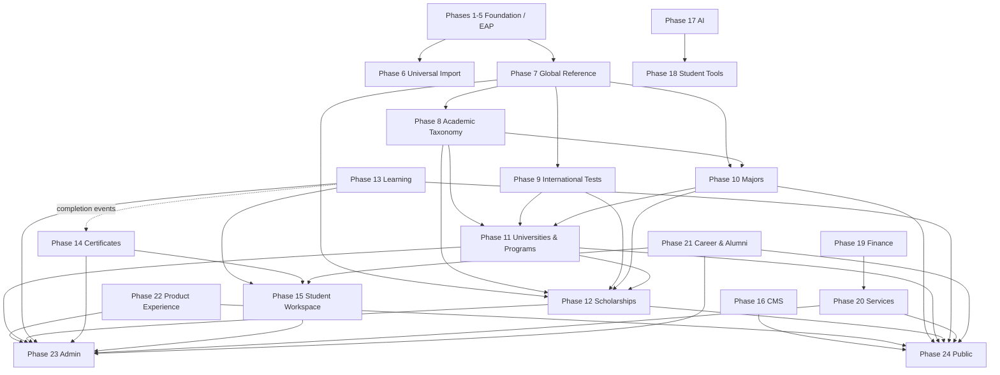

# Enterprise-Dependency-Graph-v1.0

## 1. Document Information

- **Title:** Enterprise Dependency Graph
- **Version:** 1.0.2
- **Status:** Finalized — aligned with Roadmap v6.0
- **Date:** 2026-09-03
- **Owner:** Chief Enterprise Software Architect
- **Approval Authority:** Architecture Review Board (ARB)
- **Artifact Type:** Enterprise Logical Architecture Model
- **Authority:** `docs/governance/roadmap/MANARATAK-2.0-Roadmap-v6.0.md`

> **P13 Final Source Alignment — 2026-09-03:** Re-audited against Roadmap v6.0 and the final source implementation. Ownership and dependency direction remain authoritative. Student Workspace composes P10/P11/P12 saved-item owner reads plus P13 learning and P14 certificate reads through application contracts; P24 live composition consumes P15 session/API state. Runtime/DB/E2E proof remains explicitly pending and is not certified by this document.

## 2. Purpose

This document is the authoritative logical dependency model for MANARATAK 2.0. It defines dependency direction and cross-phase ownership without redefining domain truth. Roadmap v6.0 controls phase numbering and ownership. Domain consumers may use owner APIs, read models, and events, but must not duplicate ownership or query another domain's persistence directly.

## 3. Roadmap v6.0 Phase Map

- **Phases 1–5:** Enterprise Foundation Architecture, including IAM, security, configuration, workflow/search foundations, observability, and the Phase 05 Enterprise Asset Platform (EAP).
- **Phase 6:** Universal Import Infrastructure.
- **Phase 7:** Global Reference Data.
- **Phase 8:** Academic Taxonomy.
- **Phase 9:** International Tests Platform.
- **Phase 10:** Majors & Disciplines Platform.
- **Phase 11:** Universities & Institutions Platform.
- **Phase 12:** Scholarships Platform.
- **Phase 13:** Learning Platform.
- **Phase 14:** Enterprise Certificates Platform.
- **Phase 15:** Enterprise Student Platform (Student Workspace).
- **Phase 16:** Enterprise CMS Platform.
- **Phase 17:** Enterprise AI Platform.
- **Phase 18:** Enterprise Student Tools Platform.
- **Phase 19:** Enterprise Finance & Payments Platform.
- **Phase 20:** Enterprise Services Platform.
- **Phase 21:** Enterprise Career & Alumni Platform.
- **Phase 22:** Enterprise Product Experience.
- **Phase 23:** Enterprise Administration Portal.
- **Phase 24:** Enterprise Public Platform.

Cross-cutting capabilities such as Event Platform, Background Jobs, Search, Notifications, Analytics, and configuration remain foundation/shared capabilities and do not replace phase ownership.

## 4. Dependency Classification

- **Canonical reference dependency:** Consumer stores/uses canonical IDs or owner read models from an upstream reference authority.
- **Synchronous contract:** Consumer calls an owner API/read-model contract. No direct cross-domain persistence access is allowed.
- **Asynchronous contract:** Producer publishes an owner event; consumers hydrate projections or react independently.
- **Control-plane dependency:** Phase 23 composes owner APIs for administration but does not own the underlying business truth.
- **Composition dependency:** Phase 24 renders published owner read models but does not own domain records.
- **Shared infrastructure dependency:** Cross-cutting foundation capability used through an abstract contract.

## 5. Authoritative Dependency Matrix

| Producer / Authority | Consumer | Contract Direction | Criticality | Boundary |
| --- | --- | --- | --- | --- |
| Phase 7 Global Reference Data | Phases 8–24 as applicable | Canonical IDs / reference read models | Critical | Country, region, city, language, currency and other global references remain P7 truth. |
| Phase 8 Academic Taxonomy | Phases 10, 11, 12 | Canonical taxonomy / DegreeLevel references | Critical | P8 owns taxonomy, classification hierarchy and DegreeLevel; it does **not** own majors. |
| Phase 9 International Tests | Phases 11, 12 | Canonical test IDs / read models | High | Admission and eligibility consumers reference P9 identities rather than free text. |
| Phase 10 Majors & Disciplines | Phases 11, 12, 13, 18, 24 | Major IDs / owner read models | Critical | P10 is the canonical Major SSoT. Downstream domains own their relationships to majors. |
| Phase 11 Universities & Institutions | Phase 12 | University and AcademicProgram IDs / read models | Critical | AcademicProgram authority remains P11 and binds University + Major + DegreeLevel. |
| Phase 11 Universities & Institutions | Phase 15 | Read models / personal references | High | P15 may save, view and hydrate university/program references; it does not acquire university/application ownership. |
| Phase 12 Scholarships | Phase 15 | Published scholarship read models / personal references | High | P15 may save and track workspace references. Broad scholarship-application processing is not assigned to P15 by this graph. |
| Phase 13 Learning | Phase 14 Certificates | **Completion events only** (`CourseCompleted`, `LearningPathCompleted`) | Critical | No synchronous certificate-generation ownership is assigned to P13. P14 independently owns issuance/verification/revocation. |
| Phase 13 Learning | Phase 15 | Learning progress read models | High | P15 consumes progress; P13 owns learning truth. |
| Phase 14 Certificates | Phase 15 | Certificate events/read models | High | P15 displays certificate history/telemetry; P14 owns credential lifecycle. |
| Phase 16 CMS | Phase 24 Public | Published editorial read models | High | P16 owns editorial content; P24 owns public composition/rendering. |
| Phase 17 AI | Phase 18 Student Tools | AI execution contract | High | P17 owns models/providers/prompts/execution; P18 owns tool orchestration and student-facing tool behavior. |
| Phase 19 Finance & Payments | Phases 13, 20 and other monetized domains | Payment/status read models and finance contracts | Critical | P19 is the execution authority for payments, ledger, invoices and refunds. |
| Phase 20 Services | Phase 15 / Phase 24 | Service status/read models | High | P20 owns service catalog/request/fulfillment; P15 is private workspace, P24 is public composition. |
| Phase 21 Career & Alumni | Phase 15 / Phase 24 | Career/alumni read models | High | P21 owns career opportunities, career applications and alumni metadata. |
| Domain owners P7–P21 | Phase 23 Admin | Owner command/query APIs | Critical | P23 is a control plane; no domain persistence/business truth is re-owned by Admin. |
| Published domain owners P7–P21 | Phase 24 Public | Published read models | Critical | P24 composes visitor-facing pages; no domain record ownership moves to P24. |
| Phase 22 Product Experience | Phases 23–24 | UX principles / product contracts | Medium | P22 governs product experience principles, not business-domain persistence. |
| IAM / Authorization foundation | All protected domains | Security contracts | Critical | Authentication/authorization remain cross-cutting foundation capabilities. |
| Event Platform | Domain producers/consumers | Outbox/event transport | Critical | Events preserve owner boundaries and must not create shared mutable models. |
| Background Jobs / Search / Notification / Analytics | Domain consumers | Shared service contracts | High | Access through abstractions; no shared service becomes owner of domain truth. |

## 6. Binding Dependency Rules

1. **Roadmap v6.0 is authoritative:** phase numbering or ownership cannot be changed by this graph.
2. **One owner per truth:** canonical records and lifecycle decisions remain in their owner phase.
3. **Canonical IDs first:** where a P7/P8/P9/P10/P11 canonical identity exists, final relationships must not use names, translated labels, or synthetic IDs as identity.
4. **No cross-domain Prisma/database access:** consumers use owner contracts, projections, or events.
5. **No circular ownership:** reverse navigation is a read model/projection and never transfers ownership upstream.
6. **P6 is ingestion mechanics:** final normalization/validation/publish belongs to the receiving owner domain.
7. **P13 → P14 is asynchronous completion signaling:** P13 emits completion facts; P14 owns certificate issuance and credential lifecycle. No synchronous Certificate Generation API is part of this boundary.
8. **P15 is a Student Workspace:** it owns private workspace/profile state, collections, history, personalization and references. It does not own universities, scholarships, courses, certificates, or an unspecified broad university/scholarship application engine.
9. **P23 is the administrative control plane:** it composes owner APIs and may orchestrate approved admin commands; it does not contain owner persistence/business rules.
10. **P24 is public composition:** it renders published owner read models and owns visitor routing/SEO/page assembly, not underlying domain truth.
11. **Broad application workflow ownership is not inferred:** no university/scholarship application aggregate is assigned to P12 or P15 by this artifact unless a future Roadmap/ADR explicitly adopts that owner.

## 7. Visual Model

Arrows indicate allowed dependency/consumption direction; they do not transfer data ownership.

## 8. Validation

The graph is valid only when all of the following remain true:

- all 24 Roadmap v6.0 phases are represented by their current names;
- P8 owns taxonomy/DegreeLevel and P10 owns majors;
- P13 never owns certificate issuance;
- P14 is the only certificate authority;
- P15 remains Student Workspace rather than a broad application-processing owner;
- P23 remains control-plane composition;
- P24 remains public composition/rendering;
- no synchronous circular ownership is introduced;
- no cross-domain direct persistence access is implied.

## 9. Approval and Revision History

- **Architecture Review Board:** Approved baseline; P1 authority alignment applied 2026-09-03.
- **Chief Enterprise Software Architect:** Approved baseline; Roadmap v6.0 is the controlling authority.
- **1.0.0:** Initial enterprise dependency graph.
- **1.0.1:** P1 source-closure remediation — aligned phase map/ownership to Roadmap v6.0; removed P12/P15 broad-application ownership implication; fixed P13→P14 to completion events only; added P22–P24 and explicit P23/P24 boundaries.
