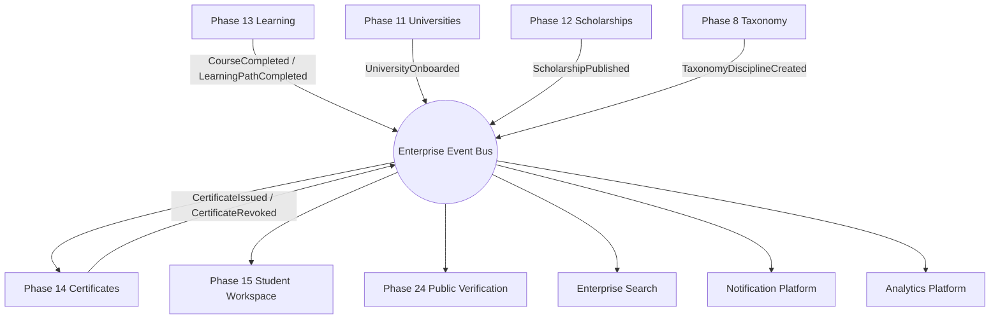

# Enterprise-Event-Catalog-v1.0

## 1. Document Information

- **Title:** Enterprise Event Catalog
- **Version:** 1.0.2
- **Status:** Finalized — aligned with Roadmap v6.0
- **Date:** 2026-09-03
- **Owner:** Chief Enterprise Software Architect
- **Approval Authority:** Architecture Review Board (ARB)
- **Artifact Type:** Enterprise Architecture Model
- **Authority:** `docs/governance/roadmap/MANARATAK-2.0-Roadmap-v6.0.md`

> **P13 Final Source Alignment — 2026-09-03:** Re-audited against Roadmap v6.0 and the final source implementation. Ownership and dependency direction remain authoritative. Student Workspace composes P10/P11/P12 saved-item owner reads plus P13 learning and P14 certificate reads through application contracts; P24 live composition consumes P15 session/API state. Runtime/DB/E2E proof remains explicitly pending and is not certified by this document.

## 2. Purpose

This document serves as the official catalog of all enterprise events within the MANARATAK 2.0 architecture. Its purpose is to provide a single source of truth for asynchronous communication, prevent duplicated events, support Event-Driven Architecture (EDA) governance, and strictly enforce Domain-Driven Design (DDD) boundaries across all bounded contexts.

## 3. Event Governance

The following architectural rules govern the enterprise event ecosystem:

- **Naming Standards:** Events must follow the `[Entity][StateChange]` past-tense convention (e.g., `CourseCompleted`, `UniversityOnboarded`).
- **Versioning Rules:** All event schemas are immutable. Changes require a new semantic version (e.g., `v1` to `v2`).
- **Deprecation Rules:** Deprecated events require a minimum 90-day sunset period, with proactive alerts to all registered consumers.
- **Ownership Rules:** An event is exclusively owned by the Bounded Context that maintains the authoritative state (Canonical Data Model) of the mutated entity.
- **Publishing Rules:** Producers must utilize the Outbox Pattern to guarantee atomicity between local database transactions and event publication.
- **Consumption Rules:** Consumers must never assume global ordering and must handle events asynchronously without blocking producer workflows.
- **Idempotency Expectations:** Consumers are strictly responsible for deduplication. All event handlers must be idempotent, utilizing the unique `EventID`.
- **Ordering Expectations:** Causal ordering is guaranteed only at the Aggregate Root level via logical partitioning keys.
- **Replay Policy:** The underlying event platform must retain events sufficiently to allow consumer replay for system recovery or new read-model hydration.
- **Dead Letter Policy:** Unprocessable events must be routed to a logical Dead Letter Queue (DLQ) for monitoring, alerting, and manual triage, preventing consumer blocking.

## 4. Event Lifecycle

1. **Creation:** A business action occurs within a Bounded Context, mutating an aggregate's state and generating a Domain Event.
2. **Publication:** The event is written to the outbox table and asynchronously swept onto the Enterprise Event Bus.
3. **Consumption:** Subscribed bounded contexts receive the event and process it according to their local business logic (e.g., updating a materialized view or triggering a workflow).
4. **Retry:** Transient consumer failures trigger automated exponential backoff retries.
5. **Failure:** Persistent consumption failures route the event to the DLQ.
6. **Archive:** Events aging past the active retention window are moved to cold storage (Data Lake) for compliance and historical analytics.
7. **Retirement:** An event schema is officially sunset after all consumers have migrated to a newer version.

## 5. Event Taxonomy

Events are classified into four architectural groups:

- **Business Domain Events:** Represent core state changes (e.g., `ScholarshipPublished`).
- **Infrastructure Events:** Represent technical state changes (e.g., `CacheInvalidated`, `ConfigurationUpdated`).
- **Cross-Domain Events:** Broadly consumed events requiring enterprise-wide schema governance.
- **Shared Services Events:** Emitted by utility platforms (e.g., `NotificationSent`, `ImportCompleted`).

## 6. Event Categories & Catalog

### 6.1. University Events

- **Event Name:** `UniversityOnboarded`
  - **Description:** Emitted when a new university profile is approved and active.
  - **Category:** University Events
  - **Producer:** Phase 11 (Universities & Institutions)
  - **Consumers:** Enterprise Search, Analytics, Phase 15 (Enterprise Student Platform (Student Workspace))
  - **Trigger:** Admin approval of a university profile.
  - **Business Meaning:** A new institution is approved for owner-domain discovery/read-model consumption.
  - **Payload Responsibility:** Logical ID, University Name, Status, Core Metadata.
  - **Criticality:** High
  - **Delivery Type:** Guaranteed (At-least-once)
  - **Event Type:** Domain Event
  - **Version Strategy:** Semantic
  - **Retention Policy:** Permanent (Event Sourcing)
  - **Ownership:** Domain Architect (Univ)

### 6.2. Scholarship Events

- **Event Name:** `ScholarshipPublished`
  - **Description:** Emitted when a scholarship opportunity becomes published and discoverable.
  - **Category:** Scholarship Events
  - **Producer:** Phase 12 (Scholarships)
  - **Consumers:** Notification Platform, Enterprise Search, Phase 15 (Enterprise Student Platform (Student Workspace))
  - **Trigger:** Scholarship lifecycle reaches the published/open discovery state.
  - **Business Meaning:** The scholarship is available to published discovery/read-model consumers; this event does not assign application-processing ownership.
  - **Payload Responsibility:** Scholarship ID, Title, Eligibility Criteria Hash.
  - **Criticality:** High
  - **Delivery Type:** Guaranteed
  - **Event Type:** Domain Event
  - **Version Strategy:** Semantic
  - **Retention Policy:** 7 Years (Compliance)
  - **Ownership:** Domain Architect (Schol)

### 6.3. Application Ownership Boundary

Roadmap v6.0 does not designate Phase 12 or Phase 15 as the owner of a general-purpose university/scholarship application-processing aggregate. Historical `ScholarshipApplicationSubmitted`, `ScholarshipApplicationApproved`, and generic student `ApplicationSubmitted` ownership claims are therefore removed from this authoritative catalog. They must not be reintroduced until a Roadmap/ADR explicitly assigns an owner and its domain/API/event contracts.

### 6.3a. Learning Completion Events

- **Event Name:** `CourseCompleted`
  - **Description:** Emitted when Phase 13 records authoritative course completion.
  - **Producer:** Phase 13 (Learning Platform)
  - **Consumers:** Phase 14 (Enterprise Certificates Platform), analytics/read-model consumers as approved
  - **Business Meaning:** Learning completion fact only; certificate issuance remains a Phase 14 decision.
  - **Payload Responsibility:** Completion ID, Course ID, Student/User reference, completion timestamp/version.
  - **Criticality:** Critical
  - **Delivery Type:** Guaranteed / idempotent consumption required
  - **Event Type:** Cross-Domain Domain Event
  - **Ownership:** Domain Architect (Learning)

- **Event Name:** `LearningPathCompleted`
  - **Description:** Emitted when Phase 13 records authoritative learning-path completion.
  - **Producer:** Phase 13 (Learning Platform)
  - **Consumers:** Phase 14 (Enterprise Certificates Platform), analytics/read-model consumers as approved
  - **Business Meaning:** Learning completion fact only; no certificate is generated inside Phase 13.
  - **Payload Responsibility:** Completion ID, LearningPath ID, Student/User reference, completion timestamp/version.
  - **Criticality:** Critical
  - **Delivery Type:** Guaranteed / idempotent consumption required
  - **Event Type:** Cross-Domain Domain Event
  - **Ownership:** Domain Architect (Learning)

### 6.3b. Certificate Events

- **Event Name:** `CertificateIssued`
  - **Description:** Emitted after Phase 14 independently validates eligibility/policy and issues a credential.
  - **Producer:** Phase 14 (Enterprise Certificates Platform)
  - **Consumers:** Phase 15 Student Workspace, Phase 24 Public verification/read-model composition, analytics as approved
  - **Business Meaning:** A credential now exists under Phase 14 lifecycle authority.
  - **Payload Responsibility:** Certificate ID, subject reference, credential type/template version, issued timestamp/status.
  - **Criticality:** Critical
  - **Delivery Type:** Guaranteed
  - **Event Type:** Cross-Domain Domain Event
  - **Ownership:** Domain Architect (Certificates)

- **Event Name:** `CertificateRevoked`
  - **Description:** Emitted when Phase 14 revokes an issued credential under immutable audit policy.
  - **Producer:** Phase 14 (Enterprise Certificates Platform)
  - **Consumers:** Phase 15 Student Workspace, Phase 24 verification/read-model composition, analytics as approved
  - **Business Meaning:** Consumers must update credential status; the certificate record remains under P14 authority.
  - **Criticality:** Critical
  - **Delivery Type:** Guaranteed
  - **Event Type:** Cross-Domain Domain Event
  - **Ownership:** Domain Architect (Certificates)

### 6.4. Academic Taxonomy Events

- **Event Name:** `TaxonomyDisciplineCreated`
  - **Description:** Emitted when a new academic discipline is added to the global hierarchy.
  - **Category:** Academic Taxonomy Events
  - **Producer:** Phase 8 (Academic Taxonomy)
  - **Consumers:** Phase 11 (Universities & Institutions), Phase 12 (Scholarships), Enterprise Search
  - **Trigger:** Content steward adds a new taxonomy node.
  - **Business Meaning:** A new field of study is available for mapping.
  - **Payload Responsibility:** Node ID, Parent ID, Discipline Name.
  - **Criticality:** Medium
  - **Delivery Type:** Guaranteed
  - **Event Type:** Reference Event
  - **Version Strategy:** Semantic
  - **Retention Policy:** Permanent
  - **Ownership:** Domain Architect (Tax)

### 6.5. Universal Import Events

- **Event Name:** `ImportJobCompleted`
  - **Description:** Emitted when an external data ETL job finishes processing.
  - **Category:** Import Events
  - **Producer:** Phase 6 (Universal Import Infrastructure)
  - **Consumers:** Owning domain import consumers, Notification Platform as approved
  - **Trigger:** Generic acquisition/parsing/import-mechanics job completes.
  - **Business Meaning:** A raw/staged import handoff is available for the receiving owner domain. Final normalization, validation, canonical identity and publish readiness remain the receiving domain's authority.
  - **Payload Responsibility:** Job ID, Source System, Record Count, Status.
  - **Criticality:** Medium
  - **Delivery Type:** Guaranteed
  - **Event Type:** System Event
  - **Version Strategy:** Semantic
  - **Retention Policy:** 30 Days
  - **Ownership:** Platform Architect (UIP)

### 6.6. Workflow Events

- **Event Name:** `SagaCompensated`
  - **Description:** Emitted when a distributed transaction fails and rolls back successfully.
  - **Category:** Workflow Events
  - **Producer:** Workflow Engine
  - **Consumers:** Core Domains (Univ, Schol, Stu), Analytics
  - **Trigger:** Saga failure leading to successful compensation logic.
  - **Business Meaning:** A business process was safely aborted and state reverted.
  - **Payload Responsibility:** Saga ID, Reason, Compensated Steps.
  - **Criticality:** High
  - **Delivery Type:** Guaranteed
  - **Event Type:** Orchestration Event
  - **Version Strategy:** Semantic
  - **Retention Policy:** 1 Year
  - **Ownership:** Platform Architect (WF)

### 6.7. Identity and Settings Events — W3 canonical contract

P05 Identity persists these versioned events atomically with owner state in the transactional outbox: `IdentityCreated.v1`, `IdentityActivated.v1`, `IdentityStatusChanged.v1`, and `IdentityContactUpdated.v1`. P05 Settings likewise emits versioned `SettingDefinitionCreated.v1`, `SettingDefinitionUpdated.v1`, `SettingValueAssigned.v1`, `SettingValueUpdated.v1`, and `SettingValueRolledBack.v1` facts. Stable event/outbox IDs, correlation metadata and idempotent consumers are mandatory. The historical `UserRegistered` label is not a canonical production event.

`IdentityCreated.v1` and lifecycle status facts feed the P15 Student Workspace projection through the durable outbox bridge. Access-denying Identity transitions additionally revoke active sessions at the Identity/Auth owner boundary; consumers must not substitute eventual projection delivery for immediate access denial.

### 6.8. W3 owner-domain event additions

- **Phase 13 Learning:** `CourseEnrolled` and `CourseProgressUpdated` are persisted atomically with enrollment/progress mutation and consumed idempotently by P15. `CourseCompleted` / `LearningPathCompleted` remain the P13→P14 credential facts.
- **Phase 20 Services:** owner-state transactions publish versioned service catalog/request/fulfillment/provider/finance-link events through the durable outbox.
- **Phase 21 Career:** employer/job lifecycle transactions publish versioned events, including `JobPosted.v1` and `JobClosed.v1`, through the durable outbox.
- **Notifications:** approved owner events may create notification intents through an explicit idempotent consumer; notification delivery itself is not domain ownership transfer.

## 7. Event Dependencies

| Producer | Consumer | Event | Interaction Pattern | Criticality |
| --- | --- | --- | --- | --- |
| **Phase 13 Learning** | **Phase 14 Certificates** | `CourseCompleted` | Completion fact -> credential policy/issuance | Critical |
| **Phase 13 Learning** | **Phase 14 Certificates** | `LearningPathCompleted` | Completion fact -> credential policy/issuance | Critical |
| **Phase 14 Certificates** | **Phase 15 Student Workspace** | `CertificateIssued` / `CertificateRevoked` | Student certificate projection | Critical |
| **Phase 14 Certificates** | **Phase 24 Public** | `CertificateIssued` / `CertificateRevoked` | Public verification projection | Critical |
| **Phase 11 Universities** | Enterprise Search | `UniversityOnboarded` | State projection (CQRS) | High |
| **Phase 12 Scholarships** | Notification/Search | `ScholarshipPublished` | Discovery notification/projection | Medium |
| **Phase 8 Academic Taxonomy** | Phase 11 Universities | `TaxonomyDisciplineCreated` | Read-model hydration | High |
| **P05 Identity** | Phase 15 Student Workspace | `IdentityCreated.v1` / `IdentityStatusChanged.v1` | Idempotent workspace provisioning/lifecycle projection | Critical |
| **Phase 13 Learning** | Phase 15 Student Workspace | `CourseEnrolled` / `CourseProgressUpdated` | Enrollment/progress projection | High |
| **Phase 20 Services** | Enterprise event projections / approved consumers | versioned Services owner events | Owner-state projection via transactional outbox | High |
| **Phase 21 Career** | Enterprise event projections / approved consumers | `JobPosted.v1` / `JobClosed.v1` and versioned owner events | Owner-state projection via transactional outbox | High |
| **Universal Import** | Owning domain import consumers | `ImportJobCompleted` | Import handoff signal; final normalization remains owner-domain responsibility | Medium |
| **All Domains** | Analytics Platform | approved domain events | Telemetry ingestion | Low |

**Binding rule:** There is no P15 `ApplicationSubmitted` enterprise event and no P12 scholarship-application event in this authority catalog unless application ownership is explicitly adopted later. P13→P14 credential integration is completion-event based only.

## 8. Visual Model

## 9. Validation

The ARB has validated this catalog against the following criteria:

- **No duplicated events:** Every state mutation is emitted uniquely by its authoritative domain.
- **Clear ownership:** Every event is mapped to a specific architectural owner.
- **DDD alignment:** Event names accurately reflect the ubiquitous language of their bounded contexts.
- **Bounded Context isolation:** Payloads contain logical identifiers, preventing structural database coupling.
- **Event consistency:** All definitions align with the canonical data model.

## 10. Risks

### Event Duplication Risks

- **Description:** Producers emitting the same logical event under different names.
- **Impact:** Medium.
- **Likelihood:** Low.
- **Mitigation:** Centralized Schema Registry enforcing strict event taxonomy.

### Ordering Risks

- **Description:** Consumers processing events out of causal sequence (e.g., `ProfileUpdated` before `ProfileCreated`).
- **Impact:** High.
- **Likelihood:** Medium.
- **Mitigation:** Enforced use of Aggregate IDs as partition keys to guarantee strict ordering per entity.

### Replay Risks

- **Description:** Consumers lacking idempotency, causing data corruption during event replays.
- **Impact:** Critical.
- **Likelihood:** Medium.
- **Mitigation:** Mandatory idempotency keys (Event ID) and UPSERT operations on all consumer databases.

### Consumer Risks

- **Description:** Downstream consumers building tight coupling to excessive payload data (Fat Events).
- **Impact:** Medium.
- **Likelihood:** High.
- **Mitigation:** Favor "Event Notification" patterns (thin payloads) over "Event-Carried State Transfer" (fat payloads) where appropriate, forcing consumers to query APIs for full state.

### Governance Risks

- **Description:** Breaking changes introduced into event payloads.
- **Impact:** Critical.
- **Likelihood:** Low.
- **Mitigation:** Automated CI/CD schema validation; breaking changes strictly require a new topic/version.

## 11. Recommendations

1. **Priority 1:** Deploy the Enterprise Schema Registry and seed it with the payloads defined in this catalog.
2. **Priority 2:** Implement the automated CI/CD pipeline checks to prevent unversioned breaking changes to event schemas.
3. **Priority 3:** Establish the standard library (SDK) for the Outbox Pattern to guarantee reliable publishing across all backend teams.

## 12. Approval

- **Architecture Review Board:** Approved
- **Chief Enterprise Software Architect:** Approved
- **Approval Status:** Formal Baseline Approved

## 13. Revision History

- **Initial Version (1.0.0):** Official Enterprise Event Catalog established for MANARATAK 2.0.
- **1.0.1 (2026-09-03):** P1 authority alignment removed unapproved P12/P15 broad-application ownership and froze P13→P14 to completion events with P14 as certificate authority.
